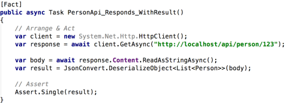

While we’re used to using xUnit for properly isolated single unit tests, the library makes it extremely easy to assert HTTP endpoints are running and responding properly.

We make use of the **System.Net.Http.HttpClient** class, available with .NET Core.

**System.Net.Http.HttpClient** makes an async call to a server running locally. Once we have a response, we deserialize the response to a model object, Person, and ensure that we got a single, valid result.

Use this approach with TDD to set out endpoints with expected responses, and apply [red-green-refactoring](https://blog.cleancoder.com/uncle-bob/2014/12/17/TheCyclesOfTDD.html) until you have all of your services online.

Lastly – how should you run your test server, which the tests will query against? If you’re using a local IIS instance or debugging through Visual Studio already, you’ll already have a suitable test server in place. Better practice, is to create a test server as part of the suite of tests, which exits and cleans up afterwards. I’ll be covering this in future posts.

