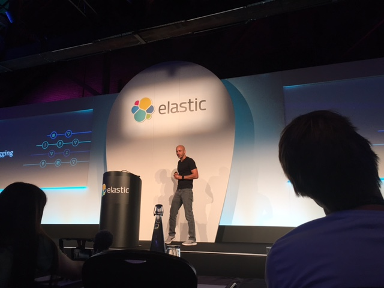
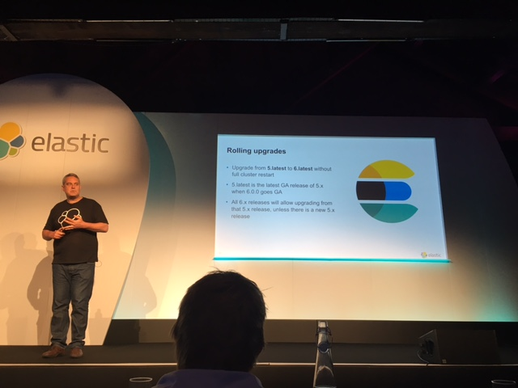
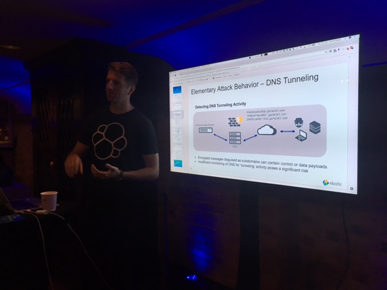
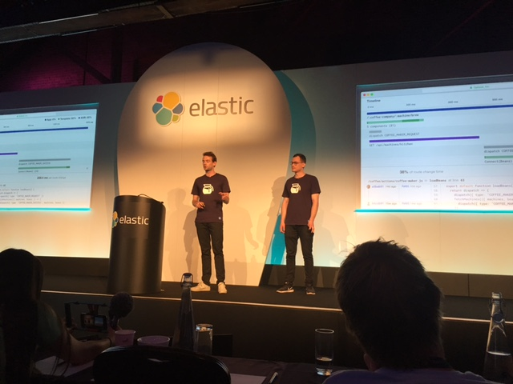
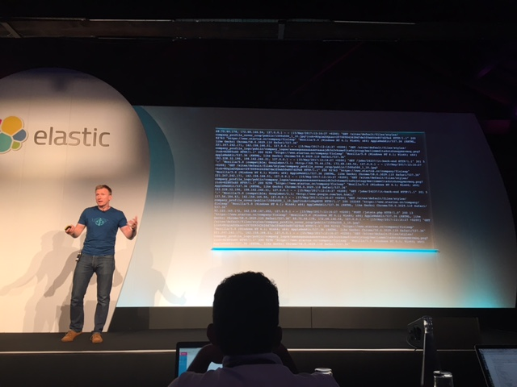

Even though Elasticsearch is built on the same foundations (Apache Lucene) as Solr, we in the Sitecore community don’t see a lot of cases where Solr or Coveo have been replaced by Elasticsearch as the main search component.

Today I’ve been at Elasticon London 2017 and have been soaking up new product releases by Elastic. Here’s some notes I scribbled and points which would be interesting to the Sitecore world.

### Elasticsearch 6.0

- Elasticsearch 6.0 is the next major release – but no firm release date has been set just yet. The official answer right now is “coming soon”.
- Elastic have recognised how painful the upgrade process is – particularly between 2.x and 5.x. When performing the upgrade, you must re-index all of your data to make it 5.x compatible – a huge job on large clusters!
- While the 2.x to 5.x upgrade path isn’t going to get much easier, Elastic are making sure that the 5.x to 6.x upgrade path doesn’t require you to re-index all data, or take nodes offline.
- The .NET client creates REST requests with a JSON payload which proxies requests and responses between your code and the Elasticsearch cluster. This is the client model they’re sticking with, and are actually rewriting the native Java client (which currently doesn’t generate REST requests) to be more in line with the .NET client.
- When it comes to swapping out Solr and Coveo for Elasticsearch, I think this would be a very individual decision based on the needs of your project.





### Anomaly Detection

- You can now create and set off unsupervised machine learning jobs to continually parse any data and highlight anomalies.
- The engineer I spoke to said usually “around three weeks” of learning will be enough to begin pulling out anomalies.
- This could have applications ranging from security (detecting usual IP or DNS activity), to marketing: spotting if a ‘suspicious’ user journey is taking place (whatever this may be!) or perhaps highlighting if a user is stuck or lost.
- The Elastic stack uses Beats – agents which can monitor a set of files, database, or network packets and streams the data into an Elasticsearch instance / cluster.



### Opcode

- Elastic founder and CEO Shay Banon announced during his keynote that Elastic have acquired Opbeat, a Copenhagen based company whose product adds monitoring and profiling to JavaScript applications (think Node.js, React and Angular).
- While this might have limited applicability for a lot of Sitecore solutions (where React and Angular might not be the norm), the interesting thing here will be to wait and see how Elastic fit Opbeat into their stack. My guess would be that they’ll extend the product and make it a more general-purpose monitoring and profiling tool.




### Machine Learning

- Elastic’s Steve Dodson (who heads up the Machine Learning product) showed us the current offering, which again is centred around anomaly detection.
- Most of Elastic’s demo use-cases for anomaly detection are for ops-level indicators like 404’s, 500s, response time, DDOS detection, and so on. Machine Learning kicks in to ignore ‘regular’ surges such as an increase in page response time during weekly batch jobs – but still alerting if the surge is stronger than usual.
- With some fiddling, you could set up an anomaly detection profiler which tolerates a certain amount of server errors after a code release (and assumes you’ll fix them), but alerts you if it looks like you’ve broken something really big.
- There was a preview of forecasting, a feature of the upcoming Elasticsearch 6.0. Forecasting does exactly as you’d expect – look at historical data and predict statistics for a future window.



### Elasticsearch SQL

Being an ex-database nerd, I loved this session. I’m not sure how the wider search community are going to feel about writing SQL again, but here’s what Elastic have in development:

- A SQL-like DSL which is 50% ANSI SQL and 50% Elasticsearch-specific syntax additions.
- You can run queries like SHOW TABLES to list all indexes, DESCRIBE my_index to show fields (columns) and datatypes. You can run search queries like this:

```sql
SELECT * FROM my_index WHERE QUERY('+chris perks')
```

- All SQL queries translate into the same old Elasticsearch QueryDSL
- Other constructs they’re including are GROUP BY, HAVING, even JOINs are in there – all translating to their equivalent Elasticsearch QueryDSL commands.
- You can even wrap SQL in JSON and use it via a REST call *confused face emoji*
- This is still heavily in development and won’t be released for a while.
 

### Summary

There’s plenty of overlap with what the Elastic stack offers, and what you’ll already have set up with Sitecore, Solr, and xDB. There’ll be a fair amount of plumbing work to get Elasticsearch set up properly with Sitecore, whereas you get this out of the box for Solr and/or Coveo.

As Elastic expand, they’re adding many new tools and capabilities to their stack, so it’s definitely not correct to see Elasticsearch as a like-for-like replacement for Solr or Coveo or parts of xDB.

I can see use cases for engaging Elasticsearch alongside your current setup, if you either need a particular Elastic capability which Sitecore / Solr doesn’t give you (such as Machine Learning, or streaming data). Or, you have more faith in the scaling capability of Elasticsearch than you do Sitecore and Solr.
