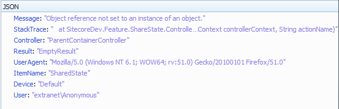

ASP.NET MVC gives us `IExceptionFilter`, with which we can create custom, global exception handlers to apply to controller actions.

```csharp
public class ExceptionLoggingFilter : FilterAttribute, IExceptionFilter
{
	public void OnException(ExceptionContext filterContext)
	{
		// filterContext now contains lots of information about our exception, controller, action, etc
		filterContext.Exception.Message;
		filterContext.Exception.StackTrace;
		filterContext.Controller.GetType().Name;
		filterContext.Result.GetType().Name;
		UserAgent = filterContext.HttpContext.Request.UserAgent;
	}
}
```

We can apply this filter to all Action methods, by adding our filter to the list of global filters:

```csharp
public class FilterConfig {
	public static void RegisterGlobalFilters(GlobalFilterCollection filters) {
		filters.Add(new ExceptionLoggingFilter());
	}
}
``` 

and wiring this up to our application in our `Application_Start` method:

```csharp
FilterConfig.RegisterGlobalFilters(GlobalFilters.Filters);
```

In Sitecore

As you may expect, Sitecore exposes this functionality as pipeline processors. Sitecore defined a custom `IExceptionFilter` implementation (see our snippet above) which kicks off the mvc.exception pipeline, passing along the `ExceptionContext` object.

As client developers, it is our job to create an appropriate processor to accept the `ExceptionContext` and do something with it. Let’s run through an example where we want to return a JSON representation of the error, loaded with as much useful information as possible.

For more reading on Sitecore controller actions returning JSON, have a look at [John West’s post](https://community.sitecore.net/technical_blogs/b/sitecorejohn_blog/posts/use-json-and-mvc-to-retrieve-item-data-with-the-sitecore-asp-net-cms)

So, first up, create an empty handler class, which inherits from `ExceptionProcessor`:

```csharp
public class JSONExceptionHandler :

Sitecore.Mvc.Pipelines.MvcEvents.Exception.ExceptionProcessor
{
	public override void Process(Sitecore.Mvc.Pipelines.MvcEvents.Exception.ExceptionArgs args)
	{

	}
}
``` 

Create a Web.config include, to add this processor to the mvc.exception pipeline:

```xml
<configuration xmlns:patch="http://www.sitecore.net/xmlconfig/">
  <sitecore>
    <pipelines>
      <mvc.exception>
        <processor type="Bleep.Handlers.JSONExceptionHandler, Bleep.Handlers"/>
      </mvc.exception>
    </pipelines>
  </sitecore>
</configuration>
```

Ok! Now our `JSONExceptionHandler` class will be called each time an exception occurs in MVC code. So, let’s grab all the detail we can from the `ExceptionContext` class and return it as JSON:

```csharp
public override void Process(Sitecore.Mvc.Pipelines.MvcEvents.Exception.ExceptionArgs args)
{
	var filterContext = args.ExceptionContext;
 
	filterContext.Result = new JsonResult
	{
		JsonRequestBehavior = JsonRequestBehavior.AllowGet,
                  Data = new
		  {
    			Message = filterContext.Exception.Message,
    			StackTrace = filterContext.Exception.StackTrace,
    			Controller = filterContext.Controller.GetType().Name,
    			Result = filterContext.Result.GetType().Name,
    			UserAgent = filterContext.HttpContext.Request.UserAgent,
    			ItemName = args.PageContext.Item.Name,
    			Device = args.PageContext.Device.DeviceItem.Name,
    			User = filterContext.HttpContext.User.Identity.Name
		  }
	};
 
	filterContext.ExceptionHandled = true;
 
	// Log the error
	Sitecore.Diagnostics.Log.Error("MVC exception processing " 
                	+ Sitecore.Context.RawUrl, args.ExceptionContext.Exception, this);
}
```

This will produce a result such as:



Happy hacking!