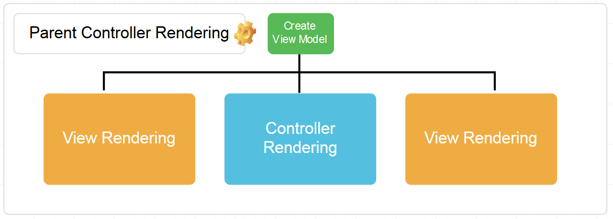

Passing data between Sitecore renderings can get tricky.

Sending messages between sibling renderings can lead us to worry about the order in which they render, and you may end up with renderings tightly coupled to other renderings. Jeremy Davis discusses ways to switch the order of rendering execution on his blog here: https://jermdavis.wordpress.com/2016/04/04/getting-mvc-components-to-communicate/


### Pass data down, not across

My preferred approach is for renderings to be as isolated as possible and not need to talk to siblings. In a regular MVC site, we would instantiate a `ViewModel`, and pass it down to any child (or partial) views as needed. If a child view doesn’t change this `ViewModel` at all, we don’t have to worry about order of execution or changes of state.

In Sitecore, we can achieve this by wrapping child renderings in a parent Controller Rendering. This Controller Rendering creates and prepares the `ViewModel`, and then passes it down to one or more child renderings.



### Let’s recap on the main points here:

1. Our parent Controller Rendering creates and prepares a `ViewModel`. This parent specifies a view, which contains one or more placeholders.
2. This `ViewModel` is passed along to any child renderings currently attached to the placeholders.
3. During execution, child renderings do not modify the `ViewModel`. We may even consider the `ViewModel` immutable while rendering takes place.

Sitecore has a peculiarity here which makes our job difficult. Each rendering gets a new instance of ViewData – explained by Kern Herskind Nightingale here: http://stackoverflow.com/a/35210022/638064. 

This puts a stop to us using `ViewData` to pass our `ViewModel` down from the parent rendering to child renderings.

#### The Workaround

There’s a way you can ensure that `ViewData` is correctly passed down from parent to child renderings. Let’s go through how this is possible.

1. In your top level controller, create a `ViewModel`, which will be passed down to all child renderings.

```csharp
public ActionResult ParentContainer()
{
    var viewModel = new {PageSize = 3, CurrentPage = 2, Results = Sitecore.Context.Item.Fields["Results"].Value};
    return View();
}
```

2. Add it to the `ViewData` collection in the current `ViewContext`

```csharp
public ActionResult ParentContainer()
{
    var viewModel = new {PageSize = 3, CurrentPage = 2, Results = Sitecore.Context.Item.Fields["Results"].Value};
    ContextService.Get().GetCurrent().ViewData.Add("_SharedModel", viewModel);
    return View();
}
```

3. In each child rendering, fetch the `ViewModel` and add it to the local `ViewData` for the current rendering (which will be empty at this point). View Renderings will do this step for you, so you don’t need to do anything special there

```csharp
public ActionResult ChildRendering()
{
    // Get any ViewData previously added to this ViewContext
    var contextViewData = ContextService.Get().GetCurrent().ViewData;
    contextViewData.ToList().ForEach(x => ViewData.Add(x.Key, x.Value));
    return View();
}
```

Et voila! You now have access to the same `ViewModel` for each of your child renderings.

```csharp
@{
    Layout = null;
    var viewModel = ViewData["_SharedModel"];
}
```

#### Making it better

MVC offers us even better tools to remove code duplication. If you have a lot of child renderings needing access to your shared `ViewModel`, adding the code in step 3 will happen a lot. Let’s refactor that to an filter attribute.

```csharp
public class RetrieveViewDataFilter : ActionFilterAttribute, IActionFilter
{
    public void OnActionExecuting(ActionExecutingContext filterContext)
    {
        //Merge ViewData from context
        var contextViewData = ContextService.Get().GetCurrent().ViewData;
        contextViewData.ToList().ForEach(x => filterContext.Controller.ViewData.Add(x.Key, x.Value));
    }

    public void OnActionExecuted(ActionExecutedContext filterContext)
    {
    }
}
```

Now, we just need to add this attribute to any Action Methods who may want to access shared `ViewData` from higher up in the stack

```csharp
[RetrieveViewDataFilter]
public ActionResult ChildRendering()
{
    return View();
}
```

There we go. I’m sure Sitecore will amend their implementation at some point, but until then, we have an immutable, single direction `ViewData` flow.