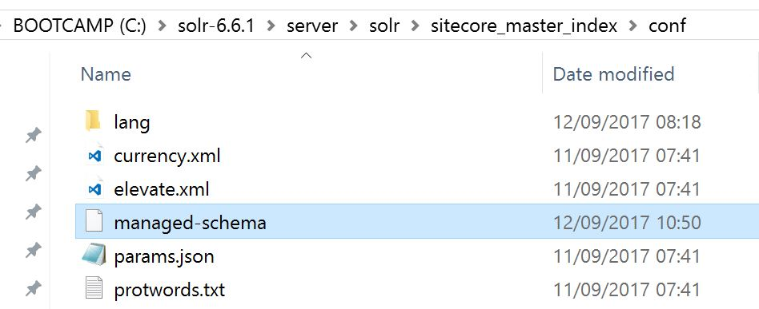
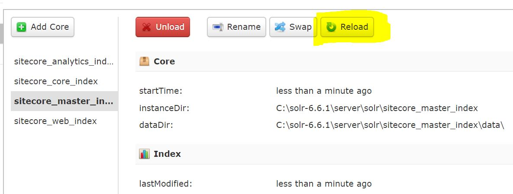
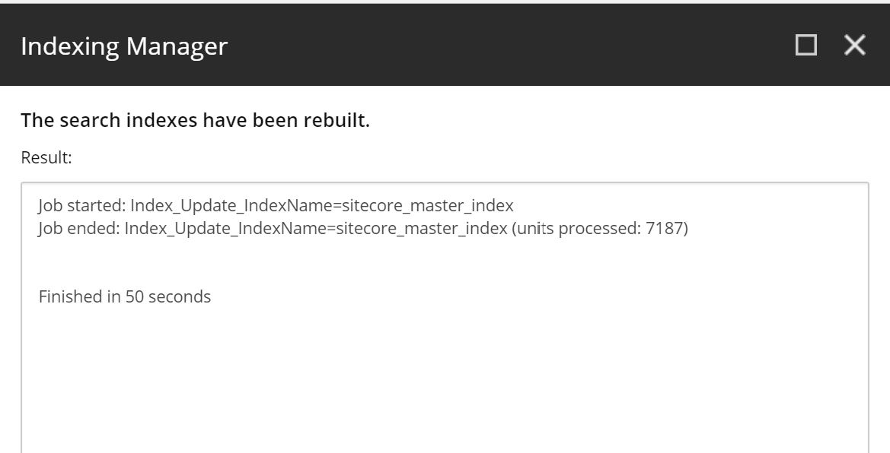

While reconfiguring Sitecore (8.2u5) to use Solr (6.6.1) instead of Lucene, I came across the following error:

```csharp
Document is missing mandatory uniqueKey field: id
```

In full:

```csharp
Job started: Index_Update_IndexName=sitecore_master_index|#Exception: System.Reflection.TargetInvocationException: Exception has been thrown by the target of an invocation. ---> SolrNet.Exceptions.SolrConnectionException: <?xml version="1.0" encoding="UTF-8"?>
<response>
<lst name="responseHeader"><int name="status">400</int><int name="QTime">1</int></lst><lst name="error"><lst name="metadata"><str name="error-class">org.apache.solr.common.SolrException</str><str name="root-error-class">org.apache.solr.common.SolrException</str></lst><str name="msg">Document is missing mandatory uniqueKey field: id</str><int name="code">400</int></lst>
</response>
 ---> System.Net.WebException: The remote server returned an error: (400) Bad Request.
 at System.Net.HttpWebRequest.GetResponse()
 at HttpWebAdapters.Adapters.HttpWebRequestAdapter.GetResponse()
 at SolrNet.Impl.SolrConnection.GetResponse(IHttpWebRequest request)
 at SolrNet.Impl.SolrConnection.PostStream(String relativeUrl, String contentType, Stream content, IEnumerable`1 parameters)
 --- End of inner exception stack trace ---
 at SolrNet.Impl.SolrConnection.PostStream(String relativeUrl, String contentType, Stream content, IEnumerable`1 parameters)
 at SolrNet.Impl.SolrConnection.Post(String relativeUrl, String s)
```

Here’s what to check.

- Does your Solr core index config directory have a file called managed-schema? If so, delete this file and reload the core. Solr will be ignoring any changes you’re making to schema.xml and using managed-schema instead. Deleting this file and reloading the core will pick up your latest version of schema.xml
 

Delete this file



Reload the core



Rebuild the index in Sitecore and the error should be gone. 

