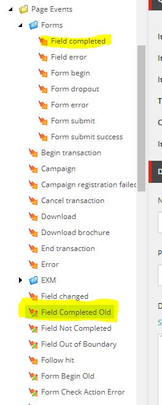

#### In this post

Installing xConnect to an 8.0 > 9.0.1 Sitecore upgrade resulted in some duplicate items in the content tree. This stops the Deploy Marketing Definitions tool from completing.

#### Problem

I had nearly completed an installation of xConnect with Sitecore 9.0.1, in xp0 configuration. Toward the end, I used the `Control Panel > Analytics > Deploy Marketing Definitions` tool. It thought for a little while, then blew up, asking me to check the logs. When I did, I found this message:

```csharp
8876 16:00:59 ERROR One or more exceptions occurred while processing the subscribers to the 'item:saving' event.
Exception[1]: System.InvalidOperationException 
Message[1]: Multiple items were found by alias 'Field Completed' 
Source[1]: Sitecore.Marketing.xMgmt 
 at Sitecore.Marketing.Definitions.Repository.ItemDefinitionRepositoryBase`1.GetItemIdByAlias(String alias)
 at Sitecore.Marketing.Definitions.Repository.ItemDefinitionRepositoryBase`1.GetByAlias(String alias, CultureInfo cultureInfo, Boolean includeInactiveVersion)
 at Sitecore.Marketing.Definitions.DefinitionManagerBase`2.GetByAlias(String alias, CultureInfo cultureInfo, Boolean includeInactiveVersion)
 at Sitecore.Marketing.xMgmt.Definitions.ItemEventHandler.ValidateAlias[TDefinitionInterface](ItemData itemData, Template itemTemplate, Guid expectedTemplateId, Dictionary`2 templateIdsInheritanceDictionary)
 at Sitecore.Marketing.xMgmt.Definitions.ItemEventHandler.ValidateItemName(ItemData itemData)
 at Sitecore.Marketing.xMgmt.Definitions.ItemEventHandler.OnItemSaving(Object sender, EventArgs args)
 at Sitecore.Events.Event.EventSubscribers.RaiseEvent(String eventName, Object[] parameters, EventResult result)
```

#### Fix

There were two Field Completed items (with the same template), in my tree at `master:/sitecore/system/Settings/Analytics/Page Events/*`



Checking the create dates, I see that the items in the Forms folder are newer. I guess the earlier ones are an overhang from our previous Sitecore 8 installation. In any case, I just renamed the older versions to {0} Old and now the Deploy Marketing Definitions tool completes. I’m now going to remove the duplicate items entirely, and ensure any links are redirected to the new version.