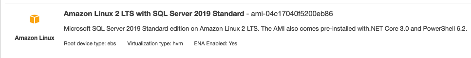

`March 2021`


The next step in readying a Kubernetes-powered AWS EKS Sitecore 10 deployment for deployment is moving the data services (Solr, MS SQL) outside of the Kubernetes cluster. 

:::info
In this blog post, look at how to separate our Sitecore 10 data services (SQL Server) from our main EKS cluster
:::

While the Kubernetes product [develops a capability](https://kubernetes.io/docs/concepts/workloads/controllers/statefulset/) for running stateful workloads, it is still best practice to keep Kubernetes for your stateless compute tasks, and run databases outside of the cluster. 

### Options on AWS 

There are two *mainstream* options available to host your SQL Server instance on AWS. Both have pros and cons, and we'll quickly summarise here. 

#### AWS RDS


RDS is a managed database product. A SQL Server instance can be provisioned through the usual channels (AWS Console, AWS CLI) and the infrastructure management (including backups) is taken care of. 

##### Pros

- Low administration burden, easy scaling, easy multi-AZ setup, automated backups and snapshots

##### Cons

- AWS does not grant you an administrator account with all abilities. Running the Sitecore 10 Kubernetes mssql-init job against an RDS database will surface many permissions errors.

```
The database settings cannot be modified. You must be a SysAdmin to apply these settings.

Procedure sys.sp_configure, Line 105
User does not have permission to perform this action.

Deployed Sitecore.Experienceforms database
Start creating database 'Sitecore.Master' with azure elastic pool 'pool'
Msg 102, Level 15, State 1, Server, Line 2
Incorrect syntax near '('.

Msg 12824, Level 16, State 1, Server, Line 1
The sp_configure value 'contained database authentication' must be set to 1 in order to alter a contained database.  You may need to use RECONFIGURE to set the value_in_use.
Msg 5069, Level 16, State 1, Server , Line 1
ALTER DATABASE statement failed.

You can only create a user with a password in a contained database.
Msg 15410, Level 11, State 1, Server, Procedure sp_addrolemember, Line 35

The sp_configure value 'contained database authentication' must be set to 1 in order to alter a contained database.  You may need to use RECONFIGURE to set the value_in_use.

You do not have permission to run the RECONFIGURE statement
```

[Workarounds exist](https://sitecore.stackexchange.com/questions/15104/installing-sitecore-9xp0-on-premise-with-amazon-rds-for-sql-server), but the main path to production deployment is still the import of an existing Sitecore database into RDS - which won't suit all workflows. 

#### SQL Server on Amazon EC2 instances


Both Windows and Linux instance can now run SQL Server, so this is a great fallback option for when you don't want to re-work installation processes to be compatible with RDS. 



##### Pros

- Full control, simply a database in the cloud
- Can use existing Sitecore 10 database initialisation methods

##### Cons

- Administration burden. Backups, scaling, failover - they're all on you. 

### A common configuration - separate VPCs

Whichever approach you choose, it is a common security and management practice to run your database workloads in a separate VPC to your EKS cluster. You may want the safety of a different security profile for your database, or monitor the VPCs using separate tooling. 

#### Connecting an RDS VPC to your Sitecore EKS cluster

1. Install jq to Powershell - we'll use this to view the outputs of our AWS service creation

```
chocolatey install jq
```

```
aws ec2 create-vpc --cidr-block 10.0.0.0/24 | jq '{VpcId:.Vpc.VpcId,CidrBlock:.Vpc.CidrBlock}'
{
  "VpcId": "vpc-042e31c800d705e90",
  "CidrBlock": "10.0.0.0/24"
}
```

```
$Env:RDS_VPC_ID="vpc-042e31c800d705e90"
```

```
aws ec2 create-subnet --availability-zone "eu-north-1b" --vpc-id $Env:RDS_VPC_ID --cidr-block 10.0.0.0/25 | jq '{SubnetId:.Subnet.SubnetId,AvailabilityZone:.Subnet.AvailabilityZone,CidrBlock:.Subnet.CidrBlock,VpcId:.Subnet.VpcId}'
{
  "SubnetId": "subnet-01daf18fc42f6c2bd",
  "AvailabilityZone": "eu-north-1b",
  "CidrBlock": "10.0.0.0/25",
  "VpcId": "vpc-042e31c800d705e90"
}
```

```
aws ec2 create-subnet --availability-zone "eu-north-1a" --vpc-id $Env:RDS_VPC_ID --cidr-block 10.0.0.128/25 | jq '{SubnetId:.Subnet.SubnetId,AvailabilityZone:.Subnet.AvailabilityZone,CidrBlock:.Subnet.CidrBlock,VpcId:.Subnet.VpcId}'
{
  "SubnetId": "subnet-00f49bdd3203cb732",
  "AvailabilityZone": "eu-north-1a",
  "CidrBlock": "10.0.0.128/25",
  "VpcId": "vpc-042e31c800d705e90"
}
```

```
aws ec2 describe-route-tables --filters Name=vpc-id,Values=$Env:RDS_VPC_ID | jq '.RouteTables[0].RouteTableId'
"rtb-050e1e8f978fee960"
```

```
$Env:RDS_ROUTE_TABLE_ID="rtb-050e1e8f978fee960"                                                             
```

```
aws ec2 associate-route-table --route-table-id rtb-050e1e8f978fee960 --subnet-id subnet-01daf18fc42f6c2bd
{
    "AssociationId": "rtbassoc-07f702e789e9bf0d4",
    "AssociationState": {
        "State": "associated"
    }
}
```

```
aws ec2 associate-route-table --route-table-id rtb-050e1e8f978fee960 --subnet-id subnet-00f49bdd3203cb732
{
    "AssociationId": "rtbassoc-066ebfe75585b5f6f",
    "AssociationState": {
        "State": "associated"
    }
}
```

```
aws rds create-db-subnet-group --db-subnet-group-name  "SitecoreDBSubnetGroup" --db-subnet-group-description "Sitecore DB Group" --subnet-ids "subnet-01daf18fc42f6c2bd" "subnet-00f49bdd3203cb732" | jq '{DBSubnetGroupName:.DBSubnetGroup.DBSubnetGroupName,VpcId:.DBSubnetGroup.VpcId,Subnets:.DBSubnetGroup.Subnets[].SubnetIdentifier}'
{
  "DBSubnetGroupName": "sitecoredbsubnetgroup",
  "VpcId": "vpc-042e31c800d705e90",
  "Subnets": "subnet-00f49bdd3203cb732"
}
{
  "DBSubnetGroupName": "sitecoredbsubnetgroup",
  "VpcId": "vpc-042e31c800d705e90",
  "Subnets": "subnet-01daf18fc42f6c2bd"
}
```

```
aws ec2 create-security-group --group-name SitecoreRDSSecurityGroup --description "Sitecore RDS security group" --vpc-id $Env:RDS_VPC_ID
{
    "GroupId": "sg-0e5793a6db4279154"
}
```

```
$Env:RDS_VPC_SECURITY_GROUP_ID="sg-0e5793a6db4279154"
```

```
aws rds create-db-instance `
   --db-instance-identifier sitecorerdsmssqldbdbinstance `
   --allocated-storage 20 `
   --db-instance-class db.t3.small `
   --engine sqlserver-ex `
   --engine-version "15.00.4073.23.v1" `
   --master-username admin `
   --storage-type standard `
   --master-user-password YOUR_PASSWORD `
   --no-publicly-accessible `
   --vpc-security-group-ids $Env:RDS_VPC_SECURITY_GROUP_ID `
   --db-subnet-group-name "sitecoredbsubnetgroup" `
   --availability-zone eu-north-1b `
   --port 1433 | jq '{DBInstanceIdentifier:.DBInstance.DBInstanceIdentifier,Engine:.DBInstance.Engine,DBName:.DBInstance.DBName,VpcSecurityGroups:.DBInstance.VpcSecurityGroups,EngineVersion:.DBInstance.EngineVersion,PubliclyAccessible:.DBInstance.PubliclyAccessible}'

{
  "DBInstanceIdentifier": "sitecorerdsmssqldbdbinstance",
  "Engine": "sqlserver-ex",
  "DBName": null,
  "VpcSecurityGroups": [
    {
      "VpcSecurityGroupId": "sg-0e5793a6db4279154",
      "Status": "active"
    }
  ],
  "EngineVersion": "15.00.4073.23.v1",
  "PubliclyAccessible": false
}
```

```
eksctl create cluster --name sitecore-cluster 
```


```
# sql-sitecore.yaml 
apiVersion: v1
kind: Service
metadata:
  labels:
    app: sql-sitecore
  name: sql-sitecore
spec:
  externalName: sitecorerdsmssqldbdbinstance.ccysvgfv15nu.eu-north-1.rds.amazonaws.com
  selector:
    app: sql-sitecore
  type: ExternalName
status:
  loadBalancer: {}
```

```
kubectl apply -f .\sql-sitecore.yaml
service/sql-sitecore created
```

##### Connecting VPCs

The real magic is now building a peering connection between our RDS and EKS VPCs. This allows the two VPCs to share network connections! 

In the AWS Console VPC section, select **Create Peering Connection**. Let the Requester be the `EKS VPC`, and the Accepter be the `RDS VPC`


Once created, right click on your new Peering Connection to **Accept** it. 


Add the Peering Connection ID as an environment variable: 

```
$Env:VPC_PEERING_CONNECTION_ID="pcx-063f211d19bc4acaa"
```


```
aws ec2 describe-route-tables --filters Name="tag:aws:cloudformation:logical-id",Values="PublicRouteTable" | jq '.RouteTables[0].RouteTableId'
"rtb-0dbf0e3285765ee7e"
```

```
$Env:EKS_ROUTE_TABLE_ID="rtb-0dbf0e3285765ee7e"
```

```
aws ec2 create-route --route-table-id $Env:EKS_ROUTE_TABLE_ID --destination-cidr-block 10.0.0.0/24 --vpc-peering-connection-id $Env:VPC_PEERING_CONNECTION_ID
{
    "Return": true
}
```

```
aws ec2 create-route --route-table-id $Env:RDS_ROUTE_TABLE_ID --destination-cidr-block 192.168.0.0/16 --vpc-peering-connection-id $Env:VPC_PEERING_CONNECTION_ID
{
    "Return": true
}
```

```
aws ec2 authorize-security-group-ingress --group-id $Env:RDS_VPC_SECURITY_GROUP_ID --protocol tcp --port 1433 --cidr 192.168.0.0/16
```


Thanks to https://dev.to/bensooraj/accessing-amazon-rds-from-aws-eks-2pc3