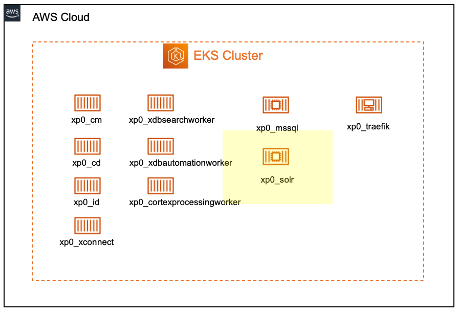
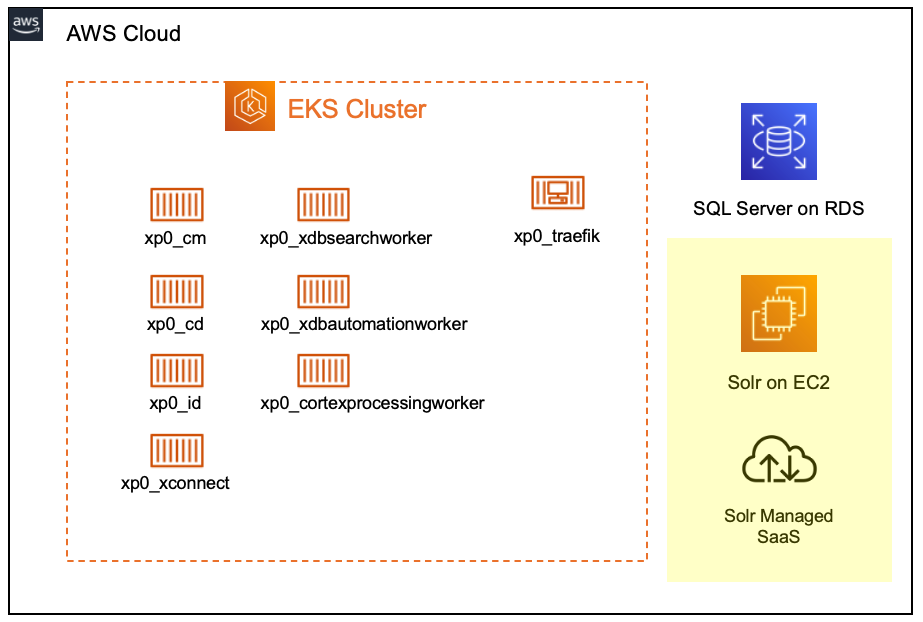
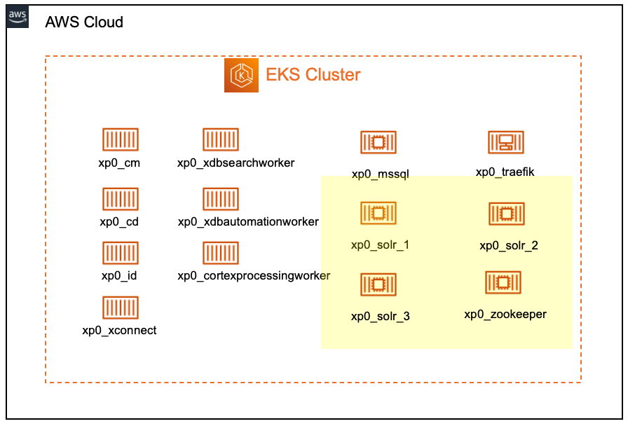
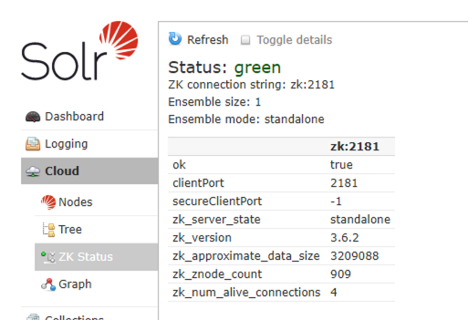
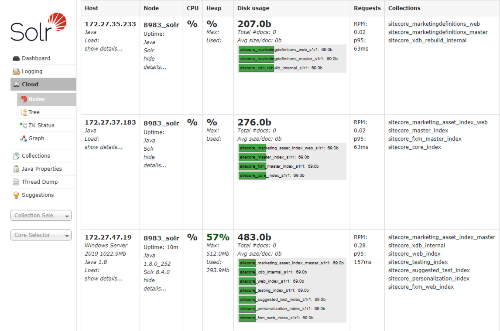
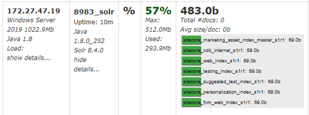
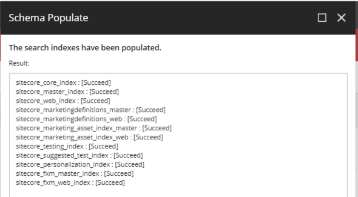
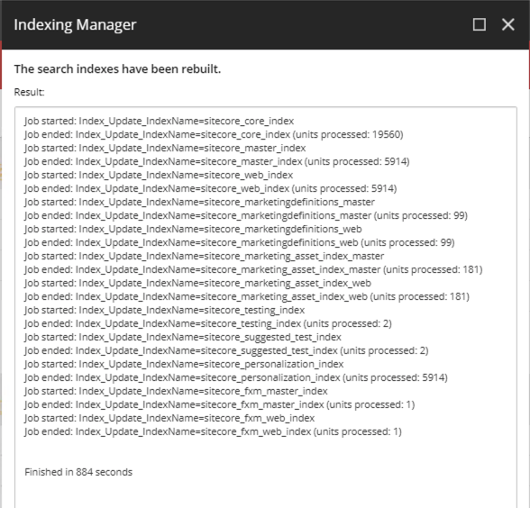
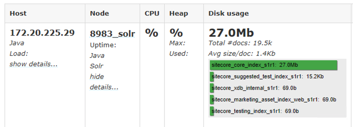
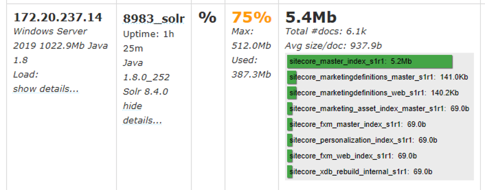

`March 2021`

:::info
In this blog post, we boost our Sitecore development environment by launching multiple Solr nodes, coordinated by ZooKeeper within a Docker container
:::

Using Sitecore's [starter Docker files](https://github.com/Sitecore/docker-examples/tree/master/getting-started), we get a single Solr instance, running in SolrCloud mode with a single node. 



While this is fine for development testing, it is handy from time-to-time to experiment and test with more production-like Solr topologies.

### Solr in Production 

Let's refresh ourselves with guidance from Sitecore and the Solr project on what a good Production architecture looks like. 

#### From Sitecore

> - Solr Cloud 8.4.0 or higher must be hosted outside the Sitecore XP cluster
> - The external hosted services for Microsoft SQL Server, SolrCloud and RedisLabs Redis are
required for production Kubernetes support from Sitecore.
> - You must deploy and configure the external services for production use before you deploy
Sitecore XP to Kubernetes.



#### From Solr

> "Although Solr comes bundled with Apache ZooKeeper, you should consider yourself discouraged from using this internal ZooKeeper in production.

> Shutting down a redundant Solr instance will also shut down its ZooKeeper server, which might not be quite so redundant. Because a ZooKeeper ensemble must have a quorum of more than half its servers running at any given time, this can be a problem.

> The solution to this problem is to set up an external ZooKeeper ensemble." 

Source: https://solr.apache.org/guide/6_6/setting-up-an-external-zookeeper-ensemble.html



Your redundancy requirements will determine exactly how many ZooKeeper and Solr nodes you use in a formation, but the foundational step for our local development environments is creating a separate ZooKeeper instance (within a container) and use that instance to manage our Solr instance (in a different container)

### Creating a Windows ZooKeeper image to use with Sitecore 

While there are plenty of [Linux ZooKeeper images on DockerHub](https://hub.docker.com/search?q=zookeeper&type=image&operating_system=linux), we need a Windows-compatible image to run alongside our other Windows Sitecore containers. 

I ended up building my own image, and have included the `Dockerfile` for you, below, should you want to use it for your own development environments. 

Here are some choices I made when creating the Dockerfile: 

1. I mostly drive the building of the image with Powershell, so base the image on the Microsoft Powershell base image. With some work you'll be able to get ZooKeeper running on a slimmer base image. 
2. I handle the downloading of Java and ZooKeeper **within** the creation of the image, simply to make this image self-contained, so you can just download the file and run `docker build .` on your machine, and everything will work.

```docker title="Dockerfile"
FROM mcr.microsoft.com/powershell

SHELL ["powershell", "-Command", "$ErrorActionPreference = 'Stop'; $ProgressPreference = 'SilentlyContinue';"]

# Set Environment Variables 
ENV JAVA_HOME=C:/openjdk-11
RUN $newPath = ('{0}\bin;{1}' -f $env:JAVA_HOME, $env:PATH); Write-Host ('Updating PATH: {0}' -f $newPath); setx /M PATH $newPath
ENV JAVA_VERSION=11.0.1
ENV JAVA_URL=https://download.java.net/java/GA/jdk11/13/GPL/openjdk-11.0.1_windows-x64_bin.zip
ENV JAVA_SHA256=289dd06e06c2cbd5e191f2d227c9338e88b6963fd0c75bceb9be48f0394ede21
ENV ZK_HOME=C:/apache-zookeeper
ENV ZK_URL=https://downloads.apache.org/zookeeper/zookeeper-3.6.2/apache-zookeeper-3.6.2-bin.tar.gz

# Install Java
RUN Write-Host ('Downloading {0} ...' -f $env:JAVA_URL); 	[Net.ServicePointManager]::SecurityProtocol = [Net.SecurityProtocolType]::Tls12; 	Invoke-WebRequest -Uri $env:JAVA_URL -OutFile 'openjdk.zip'; 	Write-Host ('Verifying sha256 ({0}) ...' -f $env:JAVA_SHA256); 	if ((Get-FileHash openjdk.zip -Algorithm sha256).Hash -ne $env:JAVA_SHA256) { 		Write-Host 'FAILED!'; 		exit 1; 	}; 		Write-Host 'Expanding ...'; 	New-Item -ItemType Directory -Path C:\temp | Out-Null; 	Expand-Archive openjdk.zip -DestinationPath C:\temp; 	Move-Item -Path C:\temp\* -Destination $env:JAVA_HOME; 	Remove-Item C:\temp; 		Write-Host 'Verifying install ...'; 	Write-Host '  java --version'; java --version; 	Write-Host '  javac --version'; javac --version; 		Write-Host 'Removing ...'; 	Remove-Item openjdk.zip -Force; 		Write-Host 'Complete.'

# Install ZooKeeper
RUN Write-Host ('Downloading {0} ...' -f $env:ZK_URL); 	[Net.ServicePointManager]::SecurityProtocol = [Net.SecurityProtocolType]::Tls12; 	Invoke-WebRequest -Uri $env:ZK_URL -OutFile 'zk.tar.gz'; 	Write-Host 'Expanding ...'; 	New-Item -ItemType Directory -Path C:\temp | Out-Null; 	tar -xf .\zk.tar.gz -C c:/temp/; 	Move-Item -Path C:\temp\* -Destination $env:ZK_HOME; 	Remove-Item C:\temp; 		Write-Host 'Removing ...'; 	Remove-Item zk.tar.gz -Force; 		 $cfgPath = ('{0}\conf\zoo_sample.cfg' -f $env:ZK_HOME);      $newCfgPath = ('{0}\conf\zoo.cfg' -f $env:ZK_HOME);     Copy-Item $cfgPath -Destination $newCfgPath;      Write-Host 'Complete.'
RUN Add-Content C:/apache-zookeeper/conf/zoo.cfg "4lw.commands.whitelist=mntr`,conf`,ruok"

# Finish Up
EXPOSE 2181
WORKDIR C:/apache-zookeeper
ENTRYPOINT ["C:/apache-zookeeper/bin/zkServer.cmd"]
```

So, without further ado, let's build the image

```bash
> docker build -t zookeeper:v1 .
Successfully built f4ab9c23f549
Successfully tagged zookeeper:v1

> docker image ls
REPOSITORY             TAG            IMAGE ID
zookeeper              v1             f4ab9c23f549
```

### Adding ZooKeeper to your docker-compose.yml 

To illustrate how we can use ZooKeeper and multiple Solr nodes in our development environments, I'm working with the [Sitecore Docker Examples getting-started](https://github.com/Sitecore/docker-examples/tree/master/getting-started) fileset. If you're working along with the examples, check that repository out and edit the files in `docker-examples/getting-started/`

Open `docker-compose.yml` and add the following service definition above `solr`

```docker title="docker-compose.yml"
zk:
  image: 'zookeeper:v1'
  ports:
    - '2181:2181'
```

### Add three Solr nodes 

Replace your `solr` service definition with the three definitions below. They're mostly the same as the definition we're replacing, with two differences: 

1. We need to make sure each service has a different port mapping, eg. `"8985:8983"`
2. We override the `entrypoint` of the Solr container to ensure the node is registered with ZooKeeper

```docker title="docker-compose.yml"
solr:
  isolation: ${ISOLATION}
  image: ${SITECORE_DOCKER_REGISTRY}nonproduction/solr:8.4.0-${SITECORE_VERSION}
  ports:
    - "8984:8983"
  volumes:
    - type: bind
      source: .\solr-data
      target: c:\data
  links:
    - zk
  environment:
    SOLR_MODE: solrcloud
  entrypoint: 
    - c:\solr\bin\solr.cmd start -port 8983 -f -z zk:2181 -noprompt
solr2:
  isolation: ${ISOLATION}
  image: ${SITECORE_DOCKER_REGISTRY}nonproduction/solr:8.4.0-${SITECORE_VERSION}
  ports:
    - "8985:8983"
  volumes:
    - type: bind
      source: .\solr-data
      target: c:\data
  links:
    - zk
  environment:
    SOLR_MODE: solrcloud
  entrypoint: 
    - c:\solr\bin\solr.cmd start -port 8983 -f -z zk:2181 -noprompt
solr3:
  isolation: ${ISOLATION}
  image: ${SITECORE_DOCKER_REGISTRY}nonproduction/solr:8.4.0-${SITECORE_VERSION}
  ports:
    - "8986:8983"
  volumes:
    - type: bind
      source: .\solr-data
      target: c:\data
  links:
    - zk
  environment:
    SOLR_MODE: solrcloud
  entrypoint: 
    - c:\solr\bin\solr.cmd start -port 8983 -f -z zk:2181 -noprompt

```

### Begin!

OK. Now that we have a docker-compose.yml file with 1 x ZooKeeper and 3 x Solr nodes, let's run our containers. 

```bash
PS C:\Users\Chris\Code\docker-examples\getting-started> docker-compose up -d
Creating network "sitecore-xp0_default" with the default driver
Creating sitecore-xp0_mssql_1 ... done
Creating sitecore-xp0_zk_1    ... done
Creating sitecore-xp0_solr3_1 ... done
Creating sitecore-xp0_solr2_1 ... done
Creating sitecore-xp0_solr_1  ... done
Creating sitecore-xp0_id_1    ... done
Creating sitecore-xp0_solr-init_1 ... done
Creating sitecore-xp0_xconnect_1  ... done
Creating sitecore-xp0_cm_1        ... done
Creating sitecore-xp0_xdbsearchworker_1        ... done
Creating sitecore-xp0_cortexprocessingworker_1 ... done
Creating sitecore-xp0_xdbautomationworker_1    ... done
Creating sitecore-xp0_traefik_1                ... done
```

### Check the status of your SolrCloud 

Navigate to the Solr UI at `http://localhost:8984/solr/#/`. First, check `Cloud > ZK Status` to make sure ZooKeeper is happy. 



Next, check `Cloud > Nodes`. Here, we can see which Solr nodes are hosting which collections. 



Looking a bit more closely, we can see that our collections are all empty, and no documents are loaded yet. 



### Populate the schema 

Once your Sitecore Docker containers are all up and running, you can use `Sitecore > Control Panel > Populate Solr Managed Schema` to do just that. 



### Perform initial indexing 

Now, we can perform an initial index, by using `Sitecore > Control Panel > Indexing Manager`



### Final status of our SolrCloud

Back in our Solr UI, we can refresh `Cloud > Nodes` to see our distributed set of collections nicely populated. 





Have fun and come chat to me on Sitecore Slack if you have any questions.