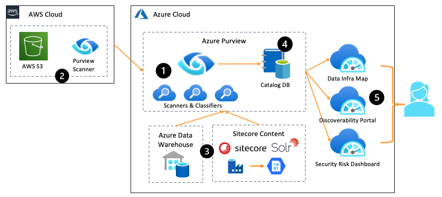
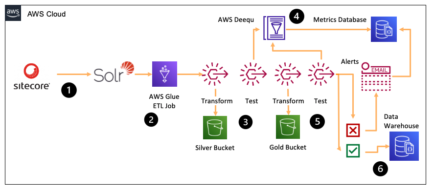
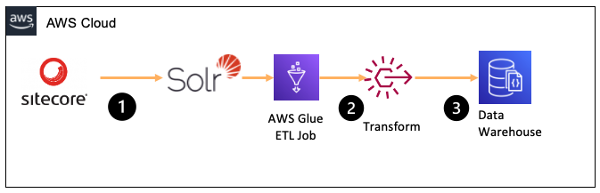

`March 2021`

:::info
In this blog post, we look at how Sitecore fits into the wider data governance picture at large organisations
:::

### Many applications, much data

In my years building software for organisations large and small, I've never built the *only* application an organisation is using. There is always a wider landscape of business applications, public facing websites and apps, ERP and CRM platforms, infrastructure management platforms, intranets, legacy databases, Excel workbooks, Jupyter notebooks, .. the list goes on. Each of these assets generates, manages and exposes data. 


There is typically a person or group of people tasked with keeping track of this data - understanding where it lives, what it represents, how to connect it to the consumers who need it, how risky the data is, and whether it is a sparkling clean RDBMS or a murky data swamp dumping zone. Deploying Sitecore into an organisation adds data to this data estate. Sitecore becomes both a consumer of other organisational data (where we source data from elsewhere in the estate to display through Sitecore) and a generator of data (content added by authors, collected via forms and uploads, or clickstream data collected as users browse and interact with our site).

### Discovering Data

As engineers, we become intimately familiar with this data, it is our domain. But can other teams really know what data we're generating and storing? They might find some of it useful, but how do they discover and use that data? How good is the quality of data contained within our Sitecore applications? Is it risky? Does it comply with wider company policies about what we can and cannot store?

These questions all fall under the umbrella of Data Governance, and when architecting or building Sitecore applications within a large enterprise, you will be expected to work together with data governance to ensure your Sitecore data is discoverable, quality assessed, and risk profiled. 

### Populating a Data Catalog

We'll concentrate on three common aspects of data governance: discoverability, quality and risk. Let's jump straight in and see how we can use modern tooling such as Azure Purview, AWS Data Catalog and AWS Deequ to build a rich data catalog and associated scanning pipelines. 



Here, we use [Azure Purview](https://azure.microsoft.com/en-gb/services/purview/) to scan various data sources, in both Azure and AWS (multi-cloud is the new normal in big companies). 

### Introducing Azure Purview

Purview runs scanners and classifiers to gather information (metadata) about your data, registering this metadata in a central database, we call the Catalog DB. 

#### Scanners

A scanner looks at the structure (schema) of our data. When targeting an RDBMS, the scanner looks at tables, columns and column datatypes. Solr gives us a nice flattened view of our Sitecore content, so we'll use that to catalog our data. Purview is still in Preview mode and as of this blog, doesn't have an ODBC connector, though I'm hopeful one is on the way. Instead of connecting directly, we use Azure Data Factory to export our Solr documents nightly, to JSON files on Azure Blob Storage. Then, we point Purview at Azure Blob Storage and once a day, the data catalog is refreshed. 

#### Classifiers

A classifier is similar to a scanner, but instead of inferring schema, we make decisions about the nature of the data we're storing in Sitecore. Once again, we look at the JSON files in Azure Blob Storage. 

A Solr document, exported to JSON:
```
{
  "bio": "I love golf and picking up Nobel prizes",
  "email": "obama@whitehouse.gov",
  "phone": "202-456-1111"
}
```

The simple document above (for a page about a member of staff) contains some interesting information, which increases the risk profile of our data. 

- `Bio` : This is just considered regular text for now. We could get clever with our classifier (people are build ML classifiers) to tag this as semantic biography text, if that's useful for your organisation. 
- `Email` : Our classifier spots this is a personally identifiable property of a person and increases the risk score of this data
- `Phone Number` : Our classifier tags this as a phone number. Several systems across the organisation will store phone numbers and it's good to know where they live, so that if someone changes their number, we can update it in all places. 

#### Save everything to the Catalog DB

Once we have gathered metadata from our Sitecore Solr indexes, we record this metadata in our Catalog DB. We do this nightly, timestamping the metadata - so we can see exactly where a schema change happened or how the risk profile of our data changes over time. 

### Testing for Quality

Now that our Sitecore data is nicely catalogued, other teams within the organisation can find it, inspect it, and potentially use it for their own applications. 

Let's take a simple use case - I'm building an internal phone directory for our organisation. Sitecore has the phone numbers for various members of staff. I'm going to run an ETL job at midnight each night, which pulls all name and phone number data from our Solr indexes and stores this in a central database. 



This is *okay*, but how can I be sure the data we're getting from Sitecore is good quality? Today, it might be the best source of everyone's phone numbers. But what if over time, the quality degrades? Bad data slips in, missing, or outdated. It would be nice to check for this and only update our master database if the quality is high enough. 

In this example, we switch things up to use [AWS Glue](https://aws.amazon.com/glue/) for ETL and [AWS Deequ](https://aws.amazon.com/blogs/big-data/test-data-quality-at-scale-with-deequ/) to perform our data testing. 



#### Deequ tests the quality of our new data

Each night, AWS Glue runs to pull phone number data directly from Solr using a JDBC connector. An ETL step cleans this data, and then immediately after, we use Deequ to scan all of the name and phone number data and calculate a quality score. This can take into account missing data, malformed data, duplicates, and so on. Once Deequ is finished, we write the quality score to a metrics database, which keeps track of the quality of our Sitecore data over time. 

Back in Glue, our next ETL step fetches all names and phone numbers from our organisation's finance system, which some teams prefer to update, instead of Sitecore. Once this second data set has been fetched, we use Deequ to correlate the two datasets and calculate a correlation score (the score is higher if both datasets match, and lower if they do not). We also write this correlation quality score the metrics database. 

#### Calculating the overall quality score

Finally, we look at our quality scores for Solr's data, and decide if we want to continue with the import. If we do, we write the latest Solr data to our central phone number store. If a threshold (say, 95% quality) is not met, we stop and generate an alert. 

### What value does the data catalog bring?

You've probably written import/export logic in the past, which handles data quality within the ETL flow. If a number is missing, skip that row. Strip bad characters, and so on. 

By recording metrics along the way, we can generate an organisation-level view of data quality, spot which systems are becoming dated or unloved, be sure we're not building critical dependencies on systems with low data quality and tracking audit-grade metadata, ready for that next inspection. 

2021 is a great year for Cloud governance tooling, with both Azure Purview and AWS Deequ challenging some of the big incumbent players (Informatica et al)

Next time you're working within a large organisation, consider how Sitecore can expose metadata to give others a view of what useful data we hold, how risky that data is, and the quality level. 
