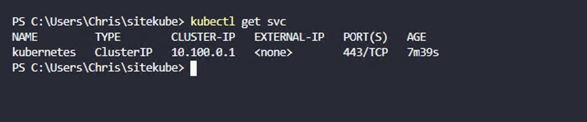

`Feb 2021`

Sitecore 10 ([released in August 2020](https://doc.sitecore.com/blog/sitecore-100-released.html)) introduced [Sitecore Containers](https://doc.sitecore.com/developers/100/developer-tools/en/containers-in-sitecore-development.html) – a modern way of running Sitecore both on a developer machine, and in a production environment. 

:::info
In this blog post, we create a new Kubernetes cluster and deploy Sitecore 10 in XM1 formation
:::


### Introducing Docker and Kubernetes

Using Docker, local development environments can be launched with minimal fuss and complete isolation from each other – enabling side-by-side installs of different Sitecore, Solr and MSSQL versions without any risk of cross-contamination. 

In production, we can use Kubernetes to manage the deployment and runtime of our Docker containers, opening up a rich new CI/CD toolset to Sitecore developers, and giving opportunities to run less host servers, reducing operating cost and using less energy. 

### But which Kubernetes?

Sitecore provide [official documentation and scripts](https://github.com/Sitecore/container-deployment/releases) for deploying Sitecore XP into a managed Kubernetes environment on Azure, the Azure Kubernetes Service (AKS). Unless you have very specific requirements (or just want the fun of running Kubernetes DIY), managed Kubernetes is a great option. You’ll save money, time and headaches by letting the cloud providers do what they do best, and manage all of the infrastructure and plumbing. 

Most organisations already have one (or more) chosen cloud provider. Often a cloud provider is just chosen based on the existing skillset of staff, an engineering preference or just by pure accident. Luckily, the official Sitecore Kubernetes deployment guided can be easily adapted to target non-Azure cloud providers. 

### In this guide

We’ll be taking you through a journey to deploy a new Sitecore 10 instance into Kubernetes using [AWS’ Elastic Kubernetes Service (EKS)](https://aws.amazon.com/eks/). This is AWS’ equivalent of Azure Kubernetes Service (AKS) and the good news is, the effort required to deploy to EKS is not much more than AKS. A few installation steps required tweaking, and we run into a few issues along the way. But if you’re an AWS user, fear not. It’s possible!

### Machine setup

In the modern world of DevOps and GitOps, we should always prefer scriptable operations. I’ve always found the AWS web console expansive, so getting to grips with a few well designed command-line tools can make the experience a lot smoother and allows you to turn your experiments into fully functioning CI/CD pipelines at a later date. 
I completed the following steps on a `Windows 10 Pro` machine with `Powershell 5.1.18362.1171`
Here is a list of the tooling we’ll be installing: 

-	**Chocolatey** – the package manager for Windows
-	**AWS CLI** – access your AWS account from the command line
-	**kubectl** – the command line tool to manage Kubernetes
-	**eksctl** – an excellent command line to accelerate the creation and management of Kubernetes clusters 
-	**helm** – the package manager for Kubernetes

##### 1. Open a Powershell session as Administrator, and install Chocolatey 

```powershell
Set-ExecutionPolicy Bypass -Scope Process -Force; [System.Net.ServicePointManager]::SecurityProtocol = [System.Net.ServicePointManager]::SecurityProtocol -bor 3072; iex ((New-Object System.Net.WebClient).DownloadString('https://chocolatey.org/install.ps1'))
```

##### 2. Install the AWS CLI 

```powershell
choco install awscli
```

##### 3. Add your AWS credentials to the current Powershell session

```powershell
$Env:AWS_ACCESS_KEY_ID="*********************"
$Env:AWS_SECRET_ACCESS_KEY="*********************"
$Env:AWS_DEFAULT_REGION="eu-north-1"
```

These will be your own credentials, you can get them from the AWS Console. Note that you should set your preferred region – here I’m using Stockholm. 

##### 4. Test to make sure the AWS CLI can connect to your account

```powershell
aws s3 ls 
```


You might not have any buckets here – that’s okay. But if you get an authentication error, your credentials are incorrect. Fix that before moving on. 

##### 5. Install the eksctl tool

```powershell
choco install eksctl 
```


##### 6. Install the kubectl tool

```powershell
choco install kubernetes-cli
```

##### 7. Check that eksctl is ready to go! Look for the region you’re using, to make sure that is correct. 

```powershell
eksctl get cluster
```


##### 8. Install Helm

```powershell
choco install kubernetes-helm
```

### Create and test the cluster

##### 9. Create the cluster

Now we can begin the action! Creating a Kubernetes cluster sounds complicated at first, but eksctl does a great job of managing the underlying components and gives you a very simple API to work with: 

```powershell
eksctl create cluster --name sitecore-10-cluster 
```

:::tip
This took around 15 minutes for me. Grab a tea!
:::


Notice that we’re not providing much configuration here. That’s perfectly fine, as eksctl will give us a new cluster with a Linux node by default. This is required on EKS. Even though our eventual Sitecore containers will run on a Windows host node, the required control plane components for EKS need to run on a Linux host. 

##### 10. Test that the cluster is up and running

```powershell
kubectl get svc
```



##### 11.	We now need to modify the cluster in preparation for launching a Windows node. This requires an extra networking component that our default cluster creation didn’t provide. Again, eksctl handles most of the work: 

```powershell
eksctl utils install-vpc-controllers –cluster sitecore-10-cluster –approve
```


##### 12. Let’s take a quick break to peek inside the AWS Console and see how things look there. If all is happy, you’ll see the following: 


We have three Kubernetes control workloads (`coredns`, `aws-node` and `kube-proxy`) along with the two VPC workloads we just created to support our Windows node: `vpc-resource-controller` and `vpc-admission-webhook`. 

### Adding the Windows node

##### 13.	As Sitecore runs inside Windows Docker containers, we need a Windows node to host those containers. 

This is one of the big differences between containers and classic virtual machines – containers share most of the OS stack with the underlying host – so (for now), Windows containers require a Windows host. 

```powershell
eksctl create nodegroup --cluster sitecore-10-cluster --name ng-windows --node-type t2.large --nodes 1 --nodes-min 1 --nodes-max 1 --node-ami-family WindowsServer2019FullContainer --region eu-north-1
```

At this point, I waited and waited, but the node never reached the `Ready` state. I had no idea what the issue was – but got the opportunity to learn some Kubernetes troubleshooting tools! See the Troubleshooting section at the end of this article. 

After some research, I discovered that the `t2.large` node type is not supported for the type of Windows deployment I was attempting. I changed this to `t3.large` and after more waiting, the node finally came online. 


### Configure the deployment

Our cluster is now up and running, with a Windows node ready for us to deploy Sitecore to. 


:::note
**A quick note on Topologies**

You may wonder why we only have a single Windows node. Is that enough? Here, you should make a choice of which Sitecore topology you wish to deploy. Sitecore themselves provide Kubernetes specifications for XM1 and XP1 topologies. I chose XM1 as this was my first attempt at a Sitecore Kubernetes deployment and I figured – less to go wrong!

From here on out, assume that the steps relate to an XM1 deployment, but that the same approach can be followed for an XP1 deployment, with a little extra care. 
::: 

##### 14.	 Now, lets grab the necessary Sitecore installation files. 

Go to the [Sitecore 10 Release Page](https://dev.sitecore.net/Downloads/Sitecore_Experience_Platform/100/Sitecore_Experience_Platform_100_Update1.aspx) and follow the link to the correct `SXP Sitecore Container Deployment` zip file. The one I used was [10.0.1.004842.266](https://github.com/Sitecore/container-deployment/releases/tag/sxp%2F10.0.1.004842.266) – but as new updates come out, you may want to use the latest. 

##### 15.	 Expand the zip and copy the contents of the k8s/ltsc2019/xm1 folder to a working area, somewhere in easy reach of your Powershell session. 

##### 16.	 Populate the secrets. 

Within the secrets folder, make sure that all `.txt` files are populated and that you’ve placed certificates into the `tls` folders. The easiest way to get all of the values you need here, in the correct formats, is to use the Getting Started Powershell configuration script from here: https://github.com/Sitecore/docker-examples/blob/develop/getting-started/init.ps1 

When everything is ready, you will have a values in all `.txt` files and a `tls.crt` / `tls.key` file in each of the subfolders of `/tls/`

### Deploy!

##### 17.	The first deployment task is for the ingress controller for our cluster. Begin by adding the help chart repository: 

```powershell
# helm repo add stable https://kubernetes-charts.storage.googleapis.com/
```

Is now deprecated, so use the following repo instead: 

```powershell
helm repo add stable https://charts.helm.sh/stable
```


##### 18.	 Now we can use helm to install our ingress controller, which is based on Nginx: 

```powershell
helm install nginx-ingress stable/nginx-ingress --set controller.replicaCount=1 --set controller.nodeSelector."beta\.kubernetes\.io/os"=linux --set defaultBackend.nodeSelector."beta\.kubernetes\.io/os"=linux --set-string controller.config.proxy-body-size=10m --set controller.service.externalTrafficPolicy=Local
```

##### 19.	Wait until the new pods are running: 

```powershell
kubectl get pods 
```


##### 20.	Deploy the secrets we just configured: 

```powershell
kubectl apply -k ./secrets/
```


##### 21.	 For our initial deployment, we’ll run Solr and MSSQL inside containers – this speeds up our workflow to get a Sitecore instance running. In production, you’ll want to swap these out for managed services. 

```powershell
kubectl apply -f ./external/
```

##### 22.	Once our Solr and MSSQL containers are in the “Running” state, we can initialise them with data: 

```powershell
kubectl apply -f ./init/
```

##### 23 At last – it’s the time to deploy our Sitecore CM, CD and ID containers!

```powershell
kubectl apply -f ./
```


##### 24. Now that our Sitecore containers are running, let’s update our Ingress controller to enable traffic to flow through our cluster: 

```powershell
kubectl apply -f ./ingress-nginx/ingress.yaml
```

### Test the deployment

##### 25. At this point, your deployments should be working away. Run the following commands to check on their status: 

```powershell
kubectl get pods 
kubectl get service -l app=nginx-ingress
```


##### 26. Once your deployment is complete, grab the EXTERNAL-IP shown above. We can use NSLOOKUP to find the IP address to add to our hosts file. 

```powershell
nslookup ABC-115789212.eu-north-1.elb.amazonaws.com
```


##### 27. Add this to your hosts file 


##### 28. Open up a browser and navigate to cm.globalhost/sitecore – if everything went to plan, you’ll see the Sitecore login page!


### Destroy all the things

##### 29. Once you’re done and happy with your experiment, you can destroy the cluster: 

```powershell
eksctl delete cluster –name=sitecore-10-cluster
```


### Troubleshooting

While deploying to EKS, I hit a few problems - mostly with invalid configurations, which I've since corrected in the steps above. However, it's handy to know how to peek inside your cluster and get more information about troubled pods and nodes. 

```powershell
kubectl get pods
```

get pods will show you a list of pods - you can then use the name of an individual pod to get detailed information on that pod: 

```powershell
kubectl describe pod my-pod
```

If there's a problem with your cluster or a particular pod, you may be able to surface the error by looking in the Kubernetes event log: 

```powershell
kubectl get events
```

### Conclusion

In this post, we've gone from an empty AWS EKS service to having a fully working Kubernetes cluster, complete with Windows worker node and running Sitecore 10. Excellent work! The team at Sitecore have put in a huge amount of work to make this deployment method available to us, and I've been really impressed with how things work. 

There are plenty of next steps - replacing the data services (Solr, MSSQL) with managed AWS services - achieving a more production-like environment with multiple nodes - scaling up and down. 

I hope to blog more about these topics in the coming months. 

Have fun!