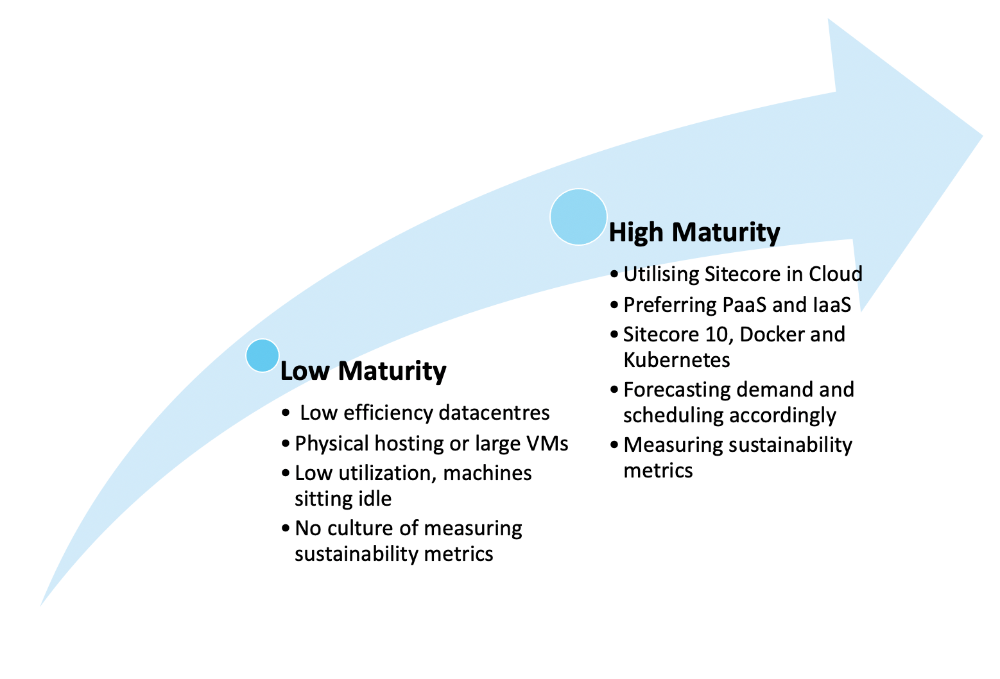

#### Azure deployment topologies and Docker-enabled Sitecore 10 present great opportunities for improving the green credentials of your Sitecore installs

### How green is your Sitecore? 

For the first time, many organisations are questioning the environmental impact of their technology, defining sustainability policies and setting KPIs for carbon and energy efficiency of applications.   

### Start with vendors

Cloud vendors are in a race to be sustainability leaders. Google (including Google Cloud) plans to run on 100% carbon-free energy by 2030. Microsoft plan to run Azure on 100% renewable energy by 2025. AWS are following, with targets to use 100% renewable energy sources (though no public timeline given). Large orgainsations now have Sustainability Lead positions, and passionate employee / user bases, who are driving the agenda from both corporate and consumer sides.

Sitecore itself has a code of conduct for suppliers (https://www.sitecore.com/trust/supplier-code) which mandates that suppliers must (at a minimum) comply with environmental laws, but must more broadly be proactive in reducing energy, water and material waste. 

> Endeavor to reduce or eliminate waste. This includes taking steps to implement appropriate conservation measures in their facilities, including water and energy conservation, through their maintenance and production processes, and by recycling, re-using, or substituting materials.

This is a great start, and I hope that Sitecore will become even more explicit in their targets in the near future, both committing to reduce their environment impact as a global organisation, and working with partners to implement Sitecore in a sustainable way. 

### What are the key sustainability measures?

#### Carbon

Most technology sustainability reports will include carbon emissions. Here, “carbon” is carbon dioxide (CO2). You may see statistics reported as CO2eq – carbon dioxide equivalent, which is carbon dioxide and other common greenhouse gasses (methane, nitrous oxide and others). The UN has set goals to reduce carbon emissions, stabilising the temperate increase of the planet. 

#### Water

Data centres are huge consumers of water for cooling purposes. Commonly, this water is from communal drinking water supplies, putting a huge demand on availability for other uses. 

#### Efficiency

What does your data centre do with the electricity it uses? Power usage effectiveness (PUE) is a common measure of data centre energy efficiency. To calculate PUE, divided the energy consumption of the entire data centre (including cooling, lighting, staff charging their Tesla), by the power consumption of the IT equipment only. The industry average is 1.8, with cloud leaders such as Google down near the 1.1 end. 

### What can you do?

#### 1: Check: how green is your datacentre? 

Your data centre will have reports available, so check them out! Look for PUE, cooling technologies and use of renewables. 

Compare this to hosting with a cloud provider. Google claims that its data centres use 50% less energy than an “average” (read: non-modern) data centres. A 2018 study found that using the Microsoft Azure cloud platform can be up to 93 per cent more energy-efficient and up to 98 per cent more carbon efficient than on-premises solutions.

But, be aware – the cloud giants marketing departments are all over this, and often non-cloud datacentres have great records too. Rackspace have previously published figures of around 1.15 PUE, and can be expected to become more efficient as time goes on.

Is your datacentre investing in evaporative cooling technologies, or at least replenishing water from supplies? Are they committed to limiting damage to their local ecosystems? Factor this investigation into your next procurement exercise. 

#### 2: Favour multi tenancy

A full XP Scaled Sitecore deployment can see 12+ virtual machines for the application tier alone. This topology allows Sitecore components to scale independently of each other – which can be a huge utilization boost. Typically, you would need a much smaller instance for the xConnect Collection service than you would a Content Management server. But if some VMs are sitting idle for most of their life, can’t we do better?

Azure deployments encourage the use of managed Web App and App Service components, which due to their multi-tenant nature, ensure higher utilization of the underlying infrastructure. Microsoft go as far as stating that using Azure is up to 98 per cent more carbon efficient than using a traditional enterprise data centre.

Sitecore 10 now officially supports running in containers – using Docker and Kubernetes. This can be great news for addressing sustainability KPIs in your Sitecore stack. 

Moving from a cluster of Virtual Machines running your Sitecore instances, to containers running on a shared host, can reduce wasted compute power by increasing utilization of each machine. From Sitecore: “Fewer resources are required to run the containers on the host since the operating system kernel is shared and no longer duplicated each time.”

A huge amount of research and development is currently going into the Kubernetes scheduler, driving down wasted compute and idle nodes, even providing new scheduling patterns for assigning nodes to pods based on the performance of your energy grid. 

#### 3: Prefer Serverless

Sitecore rarely sits alone in an application stack. Most implementations will be surrounded by an ecosystem of non-Sitecore microservices and datastores, exchanging transactions, product updates, realtime analytics and so on. How are you currently hosting these microservices?

Serverless technologies (think Azure functions, Event Grid) are hugely energy efficient, multi-tenant utilities which will almost always out-perform self-hosted versions in Virtual Machines. The cloud providers are working on your behalf to increase the utilization of the underlying infrastructure all the time – so if you can live with the vendor lock-in, serverless can be a real sustainability boost. 

#### 4: Investigate demand shaping

Demand-shaping flips our usual engineering thinking upside down. While the majority of our work as engineers is providing ultimate performance, streaming architectures, huge data crunching and realtime analytics – demand shaping asks us to consider if we could still provide a good level of service without needing so much compute. 

Could analysts live with data that is 24 hours old, rather than realtime? If so, a daily batch process could result in one less machine running for 23 hours a day. Can we wait for a minute or two before serializing that event to the data lake? If so, using a single processing service behind an event queue in place of 5 load-balanced processing services will reduce cost and energy consumption, trading off performance in its place. 

This thinking requires us to put organisational process and human behavior at the centre of our engineering decisions. If we can stagger our marketing mailouts to avoid huge peaks – that extra compute capacity may not be needed. 

#### Bonus: Track Sustainability as a KPI

The best place to get started is simply to begin having the conversations in your organisation. Do you measure carbon emissions? Does your datacentre publish its environmental credentials? Is environmental efficiency a factor in your architectural thinking, trading off against performance, reliability and scalability? It’s an exciting time to begin rethinking our success metrics for a healthy application, so I encourage you to become the sustainability champion at your place of work today!

#### Further reading: 

Microsoft Learning on Sustainable Software Engineering: 
https://docs.microsoft.com/en-gb/learn/modules/sustainable-software-engineering-overview/

Google Cloud Sustainability: https://cloud.google.com/sustainability

Green Software Engineering Principles: https://principles.green/

Microsoft Azure Sustainability: https://azure.microsoft.com/en-gb/global-infrastructure/sustainability/

Architecting for Sustainability with Serverless: https://devblogs.microsoft.com/sustainable-software/adopting-azure-serverless-architectures-to-help-reduce-co2-emissions-part-1/

